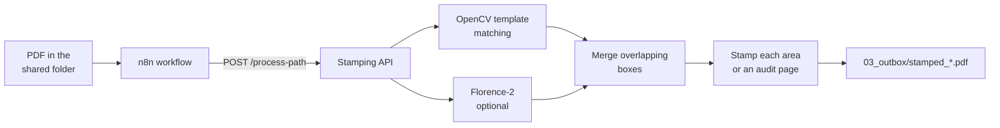

# Automated document stamping (n8n + vision AI)

A FastAPI service that finds the signature or stamp area on each page of a PDF (English or Arabic forms) and
places a stamp there. An n8n workflow sends it PDFs from a shared folder; a Streamlit UI stamps a PDF
automatically or where you click.


## How it works



1. Each page is rendered and compared with example signature and stamp areas in
   `backend/signature_stamp_templates/` (OpenCV template matching; 66 synthetic English and Arabic examples).
2. With `USE_FLORENCE=1`, Florence-2 phrase grounding ("signature line or blank space for stamp") also looks for
   areas that no template covers.
3. Overlapping boxes are merged, so each area is stamped once. Matches in the top-left corner are ignored.
4. If no area is found, an audit page is added and stamped.
5. Metadata is removed from the output. `/process-path` also checks that the file is a PDF and returns its SHA-256.

## Run it

```bash
cp .env.example .env                      # set POSTGRES_PASSWORD; optional: your stamp at backend/stamp.png
docker compose up --build -d
docker compose -f docker-compose.yml -f docker-compose.gpu.yml up --build -d   # with an NVIDIA GPU
```

| Service | Address | Use |
|---|---|---|
| n8n | http://localhost:5678 | the workflow |
| Stamping API | http://localhost:8000/health | `/process-path` (workflow), `/stamp-document/` (UI) |
| UI | http://localhost:8501 | upload a PDF and a stamp |
| PostgreSQL | localhost:5432 | database for the workflow |

Ports are bound to `localhost`. Without `backend/stamp.png`, a sample stamp is used.
`USE_FLORENCE=1` in `.env` adds Florence-2 (larger image, about 2 GB of RAM); `0` uses template matching only.

### API only

```bash
cd backend
pip install -r requirements.txt           # requirements-florence.txt adds Florence-2 (then USE_FLORENCE=1)
uvicorn main:app --port 8000
curl -F file=@form.pdf -F stamp=@stamp.example.png http://localhost:8000/stamp-document/ -o stamped.pdf
curl -F file=@form.pdf -F stamp=@stamp.example.png "http://localhost:8000/stamp-document/?x=420&y=700&page_num=1" -o manual.pdf
```

`x` and `y` are PDF points from the top-left corner of the page; the stamp is centred there.

`backend/Dockerfile` builds the template-matching API by default, which runs in 512 MB of RAM (for example on
Render's free tier). Build it with `--build-arg USE_FLORENCE=1` to include Florence-2. The container listens on
`$PORT` when it is set, otherwise on 8000.

## The n8n workflow

The workflow sends new PDFs from the shared folder (`simulated_cloud/`) to
`POST http://fastapi:8000/process-path` with `{"file_path": "/home/node/simulated_cloud/..."}`. The API only reads
files below `INPUT_ROOT` and writes `stamped_<name>` to `OUTBOX_PATH` (`simulated_cloud/03_outbox`).
n8n stores workflows in `n8n-data/` (not in git); export yours to `n8n/` to keep it with the code.

## Settings

All settings are environment variables, listed in [`.env.example`](.env.example).

## Layout

```
backend/
  main.py                       stamping API
  security_service.py           PDF check, SHA-256, metadata removal
  prefetch_models.py            downloads Florence-2 at image build time (USE_FLORENCE=1)
  requirements.txt              API with template matching
  requirements-florence.txt     adds Florence-2
  signature_stamp_templates/    example areas for template matching (synthetic)
  stamp.example.png             sample stamp
ui/app.py                       Streamlit UI (API_URL sets the API address)
docker-compose.yml              n8n + API + UI + PostgreSQL; docker-compose.gpu.yml adds a GPU
```

## Security notes

- The compose file enables n8n's Execute Command node, so keep the stack on `localhost` or behind authentication.
- Your stamp (`backend/stamp.png`) and `.env` are ignored by git.

## Author

**Mohammad Kamal Abdulaziz** - [GitHub](https://github.com/Mohammad-Kamal23) · [LinkedIn](https://www.linkedin.com/in/mohammadabdulaziz23) · moh203.kamal@gmail.com

## License

[MIT](LICENSE)
