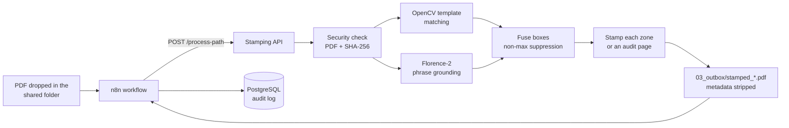

# Automated document stamping (n8n + vision AI)

An n8n workflow that stamps PDFs. The API finds where the signature or stamp goes on each page (English or Arabic
layouts), places it and returns the file to the workflow. A small web UI does the same, with a manual click-to-place
mode.


## How it works



Each page is rendered and searched by two detectors:

1. **Template matching (OpenCV)** against example signature / stamp zones in
   `backend/signature_stamp_templates/` - fast and exact for the layouts you use (66 synthetic examples included,
   English and Arabic).
2. **Florence-2 phrase grounding** ("signature line or blank space for stamp") - a zero-shot vision-language model
   that finds zones in layouts no template covers.

Their boxes are merged so a zone is never stamped twice, matches in the top-left page corner are ignored, and the
stamp is centred on each zone and kept inside the page. If nothing is found, an **audit page** is appended and
stamped, so every processed document carries an approval. Before processing, the file is checked to really be a PDF
and its SHA-256 is returned with the result; the output's metadata is stripped.

## Run it

```bash
cp .env.example .env                      # set POSTGRES_PASSWORD; put your stamp at backend/stamp.png (optional)
docker compose up --build -d              # CPU
docker compose -f docker-compose.yml -f docker-compose.gpu.yml up --build -d   # NVIDIA GPU
```

| Service | Address | What it is |
|---|---|---|
| n8n | http://localhost:5678 | the workflow (inbox -> API -> outbox -> audit log / e-mail) |
| Stamping API | http://localhost:8000/health | FastAPI: `/process-path` (workflow), `/stamp-document/` (UI) |
| UI | http://localhost:8501 | upload a PDF and a stamp; auto-detect or click to place |
| PostgreSQL | localhost:5432 | audit log written by the workflow |

All ports are bound to `localhost`. Without your own `backend/stamp.png` a clearly marked sample stamp is used.
Set `USE_FLORENCE=0` in `.env` for a light, template-only setup (no model download).

### Without Docker (API only)

```bash
cd backend
pip install -r requirements.txt           # or only fastapi uvicorn python-multipart PyMuPDF numpy opencv-python-headless Pillow
USE_FLORENCE=0 INPUT_ROOT=$PWD/.. uvicorn main:app --port 8000
curl -F file=@form.pdf -F stamp=@stamp.example.png "http://localhost:8000/stamp-document/" -o stamped.pdf
curl -F file=@form.pdf -F stamp=@stamp.example.png "http://localhost:8000/stamp-document/?x=420&y=700&page_num=1" -o manual.pdf
```

## The n8n workflow

n8n runs the automation around the API: it picks up new PDFs in the shared folder (`simulated_cloud/`, standing in
for a cloud drive), calls `POST http://fastapi:8000/process-path` with `{"file_path": "/home/node/simulated_cloud/..."}`,
receives the output path, SHA-256 and stamp positions, and records or forwards the result. The nodes enabled for
it are HTTP Request, Execute Command, Postgres (audit log) and Gmail (notifications). The API only reads files
below `INPUT_ROOT` and writes to `OUTBOX_PATH` (`simulated_cloud/03_outbox` by default).

Workflows live in n8n's own storage (`n8n-data/`, not in git). Export yours (*Workflow -> Download*) into `n8n/`
to keep it versioned with the code.

## Settings

Every setting is an environment variable in [`.env.example`](.env.example): stamp image and size, template match
threshold, Florence-2 on/off, model and prompt, input and output folders, database credentials.

## Repository layout

```
backend/
  main.py                       stamping API (detectors, fusion, placement, endpoints)
  security_service.py           PDF check, SHA-256, metadata stripping
  prefetch_models.py            downloads Florence-2 into the image at build time
  signature_stamp_templates/    example zones for template matching (synthetic)
  stamp.example.png             sample stamp (not valid for real use)
ui/app.py                       Streamlit UI
docker-compose.yml              n8n + API + UI + PostgreSQL;  docker-compose.gpu.yml adds a GPU
```

## Security notes

- Keep the stack on `localhost` or behind authentication: the workflow uses n8n's Execute Command node.
- Your real stamp or signature image stays out of git (`backend/stamp.png` is ignored).
- `.env` holds the database password and is ignored by git.

## Author

**Mohammad Kamal Abdulaziz** - [GitHub](https://github.com/Mohammad-Kamal23) · [LinkedIn](https://www.linkedin.com/in/mohammadabdulaziz23) · moh203.kamal@gmail.com

## License

[MIT](LICENSE)
